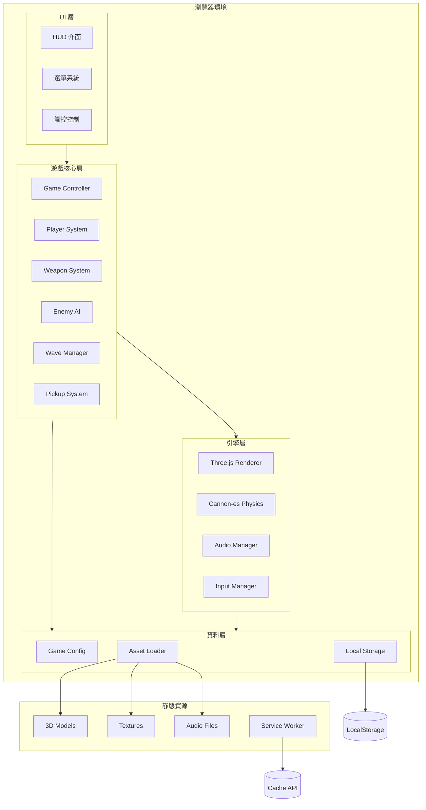
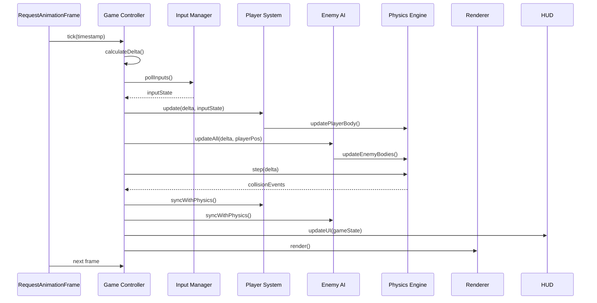
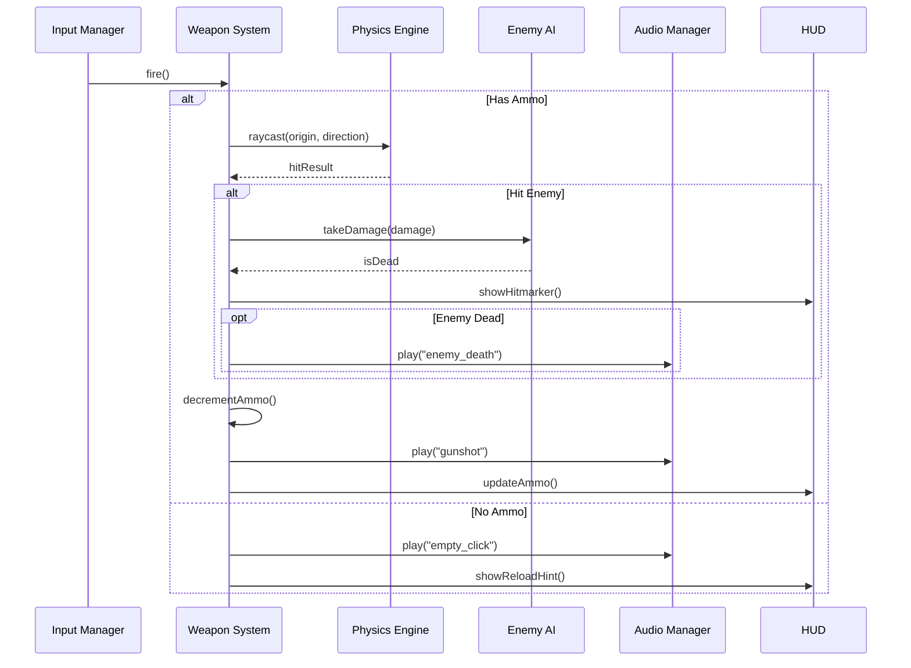
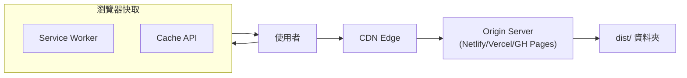

# OpenClaw FPS - System Architecture Document (SA)

**Version:** 1.0  
**Status:** APPROVED  
**Last Updated:** 2026-03-07  
**Author:** System Architect

---

## 1. 系統概觀

OpenClaw FPS 是一款純前端網頁 FPS 遊戲，採用 Three.js 渲染、Cannon-es 物理引擎，打包為靜態檔案部署，支援 PWA 離線遊玩。

### 1.1 系統架構圖



### 1.2 分層架構

| 層級 | 職責 | 主要模組 |
|------|------|----------|
| UI 層 | 使用者介面渲染、使用者輸入處理 | HUD, Menu, TouchControls |
| 核心層 | 遊戲邏輯、狀態管理 | Game, Player, Weapon, Enemy, Wave, Pickup |
| 引擎層 | 底層渲染、物理運算、音效播放 | Renderer, Physics, Audio, Input |
| 資料層 | 設定管理、資源載入、持久化 | Config, AssetLoader, Storage |

---

## 2. 元件職責

### 2.1 核心元件

#### Game Controller
- **職責**：遊戲生命週期管理、狀態機、主遊戲迴圈
- **介面**：
  - `init()`: 初始化遊戲
  - `start()`: 開始遊戲
  - `pause()`: 暫停遊戲
  - `resume()`: 恢復遊戲
  - `gameOver()`: 遊戲結束
  - `update(delta)`: 每幀更新

#### Player System
- **職責**：玩家控制、第一人稱視角、碰撞處理
- **狀態**：位置、旋轉、血量、當前武器
- **介面**：
  - `move(direction)`: 移動
  - `jump()`: 跳躍
  - `look(delta)`: 視角旋轉
  - `takeDamage(amount)`: 受傷
  - `heal(amount)`: 回血

#### Weapon System
- **職責**：武器管理、射擊、換彈、切換
- **狀態**：當前武器、彈藥數、換彈狀態
- **介面**：
  - `fire()`: 射擊
  - `reload()`: 換彈
  - `switchWeapon(index)`: 切換武器
  - `addAmmo(type, amount)`: 增加彈藥

#### Enemy AI
- **職責**：敵人行為、路徑規劃、攻擊邏輯
- **狀態**：位置、血量、AI 狀態（巡邏/追擊/攻擊）
- **介面**：
  - `spawn(position, type)`: 生成敵人
  - `update(delta, playerPosition)`: AI 更新
  - `takeDamage(amount)`: 受傷
  - `die()`: 死亡

#### Wave Manager
- **職責**：波次管理、敵人生成、難度遞增
- **狀態**：當前波次、存活敵人數、分數
- **介面**：
  - `startWave(number)`: 開始波次
  - `onEnemyDeath()`: 敵人死亡回調
  - `isWaveComplete()`: 檢查波次完成
  - `getScore()`: 獲取分數

#### Pickup System
- **職責**：補給品生成、拾取檢測
- **狀態**：場上補給品列表
- **介面**：
  - `spawnPickup(type, position)`: 生成補給
  - `checkPickup(playerPosition)`: 檢查拾取
  - `applyPickup(type, player)`: 應用效果

### 2.2 引擎元件

#### Renderer (Three.js Wrapper)
- **職責**：3D 渲染、場景管理、相機控制
- **介面**：
  - `init(canvas)`: 初始化渲染器
  - `render()`: 渲染一幀
  - `addObject(mesh)`: 加入物件
  - `removeObject(mesh)`: 移除物件
  - `resize()`: 調整大小

#### Physics (Cannon-es Wrapper)
- **職責**：物理模擬、碰撞偵測、剛體管理
- **介面**：
  - `init()`: 初始化物理世界
  - `step(delta)`: 物理步進
  - `addBody(body)`: 加入剛體
  - `removeBody(body)`: 移除剛體
  - `raycast(from, to)`: 射線檢測

#### Audio Manager
- **職責**：音效播放、音量控制
- **介面**：
  - `play(sound)`: 播放音效
  - `playLoop(sound)`: 循環播放
  - `stop(sound)`: 停止播放
  - `setVolume(volume)`: 設定音量

#### Input Manager
- **職責**：輸入事件處理、按鍵映射
- **介面**：
  - `init()`: 初始化輸入監聽
  - `isKeyPressed(key)`: 檢查按鍵
  - `getMouseDelta()`: 獲取滑鼠移動
  - `onPointerLock()`: 指標鎖定事件

### 2.3 UI 元件

#### HUD
- **職責**：即時遊戲資訊顯示
- **顯示內容**：血量條、彈藥數、波次、分數、準星
- **介面**：
  - `updateHealth(value)`: 更新血量
  - `updateAmmo(current, max)`: 更新彈藥
  - `updateWave(number)`: 更新波次
  - `updateScore(score)`: 更新分數
  - `showHitmarker()`: 顯示擊中標記
  - `showDamageIndicator(direction)`: 顯示受傷方向

#### Menu
- **職責**：選單導航、遊戲設定
- **畫面**：主選單、暫停選單、設定選單、遊戲結束畫面
- **介面**：
  - `showMain()`: 顯示主選單
  - `showPause()`: 顯示暫停選單
  - `showGameOver(score)`: 顯示遊戲結束
  - `hide()`: 隱藏選單

#### TouchControls
- **職責**：觸控設備虛擬控制器
- **元素**：虛擬搖桿、射擊按鈕、換彈按鈕、跳躍按鈕
- **介面**：
  - `init()`: 初始化觸控控制
  - `getMovementVector()`: 獲取移動向量
  - `getLookDelta()`: 獲取視角變化
  - `show()`: 顯示觸控控制
  - `hide()`: 隱藏觸控控制

---

## 3. 資料流

### 3.1 遊戲主迴圈資料流



### 3.2 射擊資料流



---

## 4. 部署架構

### 4.1 靜態檔案結構

```
dist/
├── index.html          # 入口頁面
├── assets/
│   ├── index-[hash].js # 打包後 JS
│   ├── index-[hash].css# 打包後 CSS
│   ├── models/         # 3D 模型 (GLB)
│   ├── textures/       # 材質貼圖
│   └── audio/          # 音效檔案
├── manifest.json       # PWA Manifest
├── sw.js               # Service Worker
└── icons/              # PWA 圖示
```

### 4.2 CDN / 靜態伺服器部署



### 4.3 PWA 離線策略

| 資源類型 | 快取策略 | 說明 |
|----------|----------|------|
| HTML | Network First | 確保最新版本 |
| JS/CSS | Cache First | 打包帶 hash，可長期快取 |
| 3D Models | Cache First | 模型穩定，優先使用快取 |
| Audio | Cache First | 音效穩定，優先使用快取 |
| Textures | Cache First | 材質穩定，優先使用快取 |

---

## 5. 第三方依賴

### 5.1 Runtime Dependencies

| 套件 | 版本 | 用途 | 大小 (gzip) |
|------|------|------|-------------|
| three | ^0.160.0 | 3D 渲染引擎 | ~150 KB |
| cannon-es | ^0.20.0 | 物理引擎 | ~50 KB |

### 5.2 Dev Dependencies

| 套件 | 版本 | 用途 |
|------|------|------|
| typescript | ^5.3.0 | TypeScript 編譯 |
| vite | ^5.0.0 | 打包工具 |
| vite-plugin-pwa | ^0.17.0 | PWA 支援 |
| @types/three | ^0.160.0 | Three.js 型別 |
| vitest | ^1.0.0 | 單元測試 |

### 5.3 不使用的套件（設計決策）

| 避免使用 | 理由 |
|----------|------|
| React/Vue/Angular | 純遊戲，不需要 UI 框架，減少打包大小 |
| Tailwind CSS | HUD 簡單，原生 CSS 足夠 |
| Socket.io | 單機遊戲，無需網路通訊 |
| Webpack | Vite 更快、配置更簡單 |

---

## 6. 效能考量

### 6.1 渲染優化
- 使用 Low-poly 模型減少頂點數
- 物件池（Object Pool）重用敵人和子彈
- 視錐剔除（Frustum Culling）由 Three.js 自動處理
- 合併靜態幾何體減少 draw call

### 6.2 物理優化
- 簡化碰撞體積（使用 Box/Sphere 而非 Mesh）
- 限制物理更新頻率（固定 60 Hz）
- 敵人 AI 分批更新（每幀更新部分敵人）

### 6.3 記憶體管理
- 正確釋放 Three.js 材質和幾何體
- 使用 WeakMap 管理物件引用
- 資源載入完成後釋放臨時資料

### 6.4 載入優化
- 關鍵資源優先載入（玩家模型、主要武器）
- 非關鍵資源延遲載入（音效、遠景）
- 使用 WebP/KTX2 壓縮材質

---

## 7. 安全考量

### 7.1 前端安全
- 無敏感 API 呼叫，純前端遊戲
- LocalStorage 僅儲存分數和設定
- 不存取任何使用者隱私資料

### 7.2 遊戲完整性
- 分數計算在前端（可被修改，但單機遊戲可接受）
- 未來若加入排行榜 API，需後端驗證

### 7.3 CSP 設定建議
```
Content-Security-Policy: 
  default-src 'self';
  script-src 'self';
  style-src 'self' 'unsafe-inline';
  img-src 'self' data:;
  font-src 'self';
  connect-src 'self';
```

---

## 8. 擴展性設計

### 8.1 武器擴展
武器使用配置檔定義，新增武器只需加入設定：

```typescript
interface WeaponConfig {
  id: string;
  name: string;
  damage: number;
  fireRate: number;    // 每秒射擊次數
  magazineSize: number;
  reloadTime: number;  // 毫秒
  spread: number;      // 散射角度
  projectileCount: number; // 散彈用
}
```

### 8.2 敵人擴展
敵人類型同樣使用配置驅動：

```typescript
interface EnemyConfig {
  id: string;
  name: string;
  health: number;
  speed: number;
  damage: number;
  attackRange: number;
  attackType: 'melee' | 'ranged';
  model: string;
}
```

### 8.3 地圖擴展
地圖使用 JSON 格式定義，支援動態載入：

```typescript
interface MapConfig {
  id: string;
  name: string;
  modelPath: string;
  spawnPoints: Vector3[];
  pickupSpawns: Vector3[];
  navMesh?: string;
}
```

---

**Document Control**

| 版本 | 日期 | 作者 | 變更說明 |
|------|------|------|----------|
| 1.0 | 2026-03-07 | SA Team | 初版發布 |
