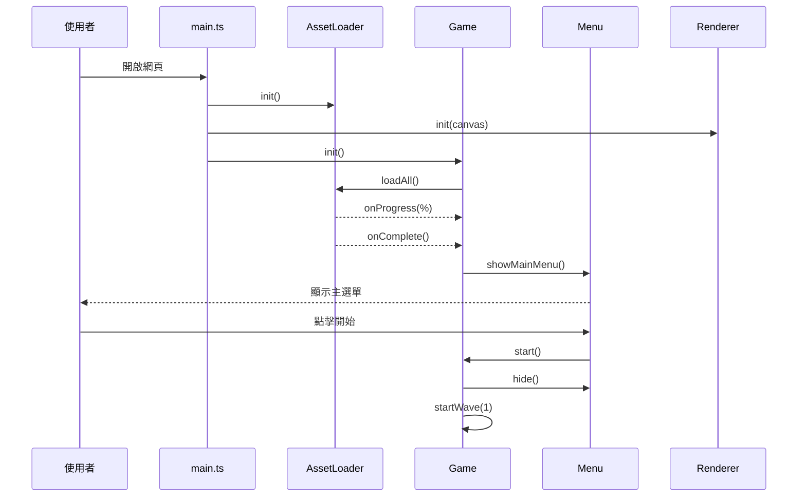
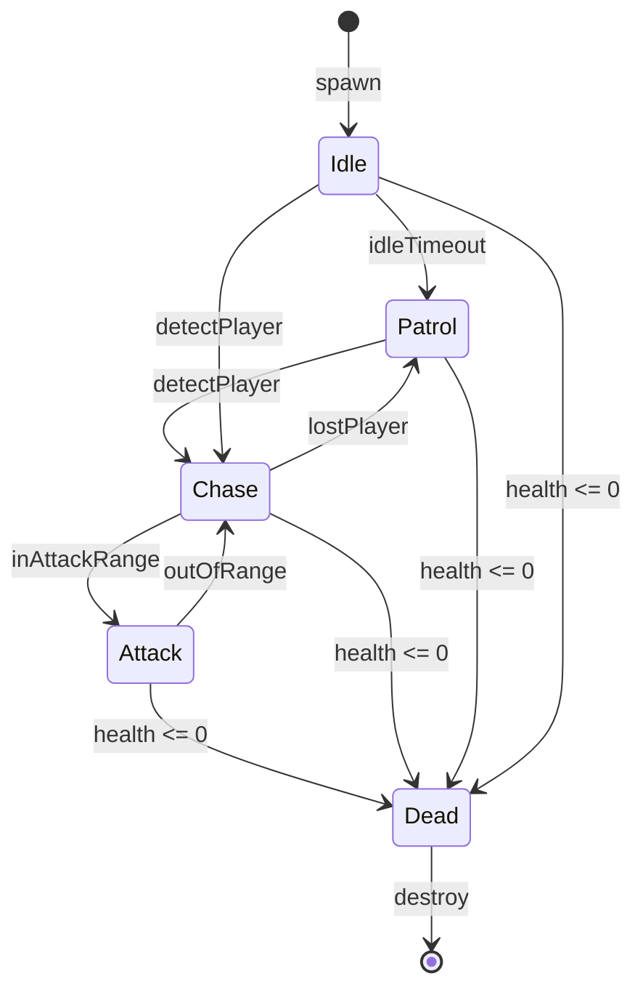
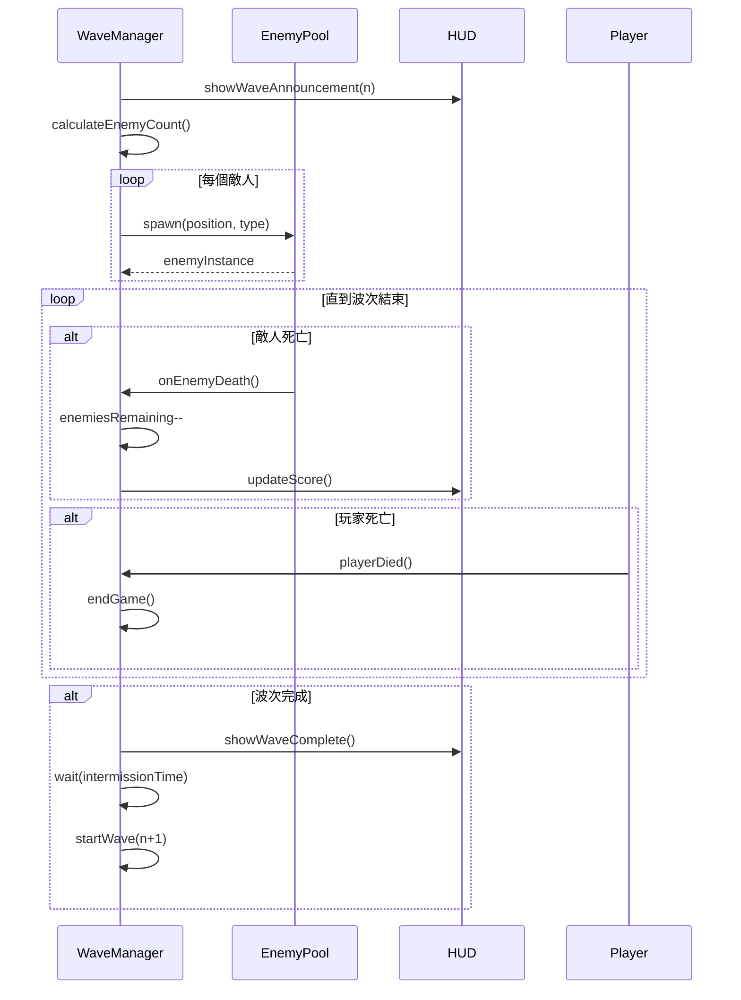
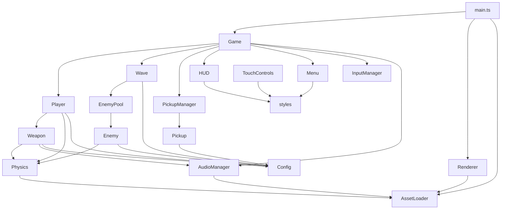

# OpenClaw FPS - System Design Document (SD)

**Version:** 1.0  
**Status:** APPROVED  
**Last Updated:** 2026-03-07  
**Author:** System Architect

---

## 1. 模組介面定義

### 1.1 遊戲狀態型別

```typescript
// src/types/GameTypes.ts

export type GameState = 'loading' | 'menu' | 'playing' | 'paused' | 'gameOver';

export type WeaponType = 'pistol' | 'shotgun' | 'assault_rifle';

export type EnemyType = 'melee' | 'ranged';

export type PickupType = 'health' | 'ammo_pistol' | 'ammo_shotgun' | 'ammo_rifle';

export interface Vector3 {
  x: number;
  y: number;
  z: number;
}

export interface GameStats {
  wave: number;
  score: number;
  enemiesKilled: number;
  damageDealt: number;
  damageTaken: number;
  shotsFired: number;
  accuracy: number;
}
```

### 1.2 核心模組介面

#### Game Controller

```typescript
// src/game/Game.ts

export interface IGame {
  // 狀態
  readonly state: GameState;
  readonly stats: GameStats;
  
  // 生命週期
  init(): Promise<void>;
  start(): void;
  pause(): void;
  resume(): void;
  restart(): void;
  
  // 遊戲迴圈
  update(delta: number): void;
  
  // 事件
  onGameOver(callback: (stats: GameStats) => void): void;
  onWaveComplete(callback: (wave: number) => void): void;
}
```

#### Player System

```typescript
// src/game/Player.ts

export interface IPlayer {
  // 狀態
  readonly position: Vector3;
  readonly rotation: { pitch: number; yaw: number };
  readonly health: number;
  readonly maxHealth: number;
  readonly isAlive: boolean;
  readonly currentWeapon: WeaponType;
  
  // 移動
  move(forward: number, right: number, delta: number): void;
  jump(): void;
  look(deltaX: number, deltaY: number): void;
  
  // 戰鬥
  takeDamage(amount: number, fromDirection?: Vector3): void;
  heal(amount: number): void;
  
  // 武器
  fire(): boolean;
  reload(): void;
  switchWeapon(type: WeaponType): void;
  addAmmo(type: WeaponType, amount: number): void;
  
  // 同步
  update(delta: number): void;
  syncWithPhysics(): void;
}

export interface PlayerConfig {
  moveSpeed: number;        // 單位/秒
  jumpForce: number;        // 跳躍力
  mouseSensitivity: number; // 滑鼠靈敏度
  maxHealth: number;        // 最大血量
  height: number;           // 玩家高度
  radius: number;           // 碰撞半徑
}
```

#### Weapon System

```typescript
// src/game/Weapon.ts

export interface IWeapon {
  readonly type: WeaponType;
  readonly config: WeaponConfig;
  readonly currentAmmo: number;
  readonly reserveAmmo: number;
  readonly isReloading: boolean;
  readonly canFire: boolean;
  
  fire(): HitResult | null;
  reload(): void;
  addAmmo(amount: number): void;
  update(delta: number): void;
}

export interface WeaponConfig {
  type: WeaponType;
  name: string;
  damage: number;
  headshotMultiplier: number;
  fireRate: number;           // 每秒射擊次數
  magazineSize: number;
  maxReserveAmmo: number;
  reloadTime: number;         // 毫秒
  spread: number;             // 散射角度（度）
  projectileCount: number;    // 每次射擊子彈數（散彈槍用）
  range: number;              // 射程
}

export interface HitResult {
  hit: boolean;
  target?: IEnemy;
  position?: Vector3;
  damage?: number;
  isHeadshot?: boolean;
}
```

#### Enemy AI

```typescript
// src/game/Enemy.ts

export type EnemyState = 'idle' | 'patrol' | 'chase' | 'attack' | 'dead';

export interface IEnemy {
  readonly id: string;
  readonly type: EnemyType;
  readonly position: Vector3;
  readonly health: number;
  readonly maxHealth: number;
  readonly state: EnemyState;
  readonly isAlive: boolean;
  
  init(position: Vector3, config: EnemyConfig): void;
  update(delta: number, playerPosition: Vector3): void;
  takeDamage(amount: number, isHeadshot: boolean): void;
  die(): void;
  reset(): void;
  
  onDeath(callback: (enemy: IEnemy, points: number) => void): void;
}

export interface EnemyConfig {
  type: EnemyType;
  name: string;
  health: number;
  speed: number;            // 單位/秒
  damage: number;           // 攻擊傷害
  attackRange: number;      // 攻擊範圍
  attackCooldown: number;   // 攻擊冷卻（毫秒）
  detectionRange: number;   // 偵測範圍
  scoreValue: number;       // 擊殺分數
  modelScale: number;       // 模型縮放
}
```

#### Wave Manager

```typescript
// src/game/Wave.ts

export interface IWaveManager {
  readonly currentWave: number;
  readonly enemiesRemaining: number;
  readonly isWaveActive: boolean;
  readonly score: number;
  
  startWave(waveNumber: number): void;
  onEnemyDeath(enemy: IEnemy): void;
  isWaveComplete(): boolean;
  getWaveConfig(wave: number): WaveConfig;
  
  onWaveStart(callback: (wave: number) => void): void;
  onWaveComplete(callback: (wave: number, score: number) => void): void;
}

export interface WaveConfig {
  wave: number;
  totalEnemies: number;
  meleeCount: number;
  rangedCount: number;
  spawnDelay: number;       // 敵人生成間隔（毫秒）
  enemyHealthMultiplier: number;
  enemyDamageMultiplier: number;
}
```

#### Pickup System

```typescript
// src/game/Pickup.ts

export interface IPickup {
  readonly id: string;
  readonly type: PickupType;
  readonly position: Vector3;
  readonly isCollected: boolean;
  
  collect(player: IPlayer): void;
  update(delta: number): void;
}

export interface IPickupManager {
  spawnPickup(type: PickupType, position: Vector3): IPickup;
  spawnRandomPickup(position: Vector3): IPickup;
  checkCollisions(playerPosition: Vector3, collectRadius: number): void;
  update(delta: number): void;
  clear(): void;
}

export interface PickupConfig {
  type: PickupType;
  value: number;              // 回復量/彈藥數
  respawnTime: number;        // 重生時間（毫秒），0 為不重生
  collectRadius: number;      // 拾取半徑
}
```

---

## 2. 引擎層介面

### 2.1 Renderer

```typescript
// src/engine/Renderer.ts

export interface IRenderer {
  readonly scene: THREE.Scene;
  readonly camera: THREE.PerspectiveCamera;
  readonly domElement: HTMLCanvasElement;
  
  init(container: HTMLElement): void;
  render(): void;
  resize(): void;
  
  addObject(object: THREE.Object3D): void;
  removeObject(object: THREE.Object3D): void;
  
  setFog(color: number, near: number, far: number): void;
  setAmbientLight(color: number, intensity: number): void;
  
  // 效能
  getDrawCalls(): number;
  getTriangles(): number;
  getFPS(): number;
}
```

### 2.2 Physics

```typescript
// src/engine/Physics.ts

export interface IPhysics {
  readonly world: CANNON.World;
  
  init(): void;
  step(delta: number): void;
  
  // 剛體管理
  addBody(body: CANNON.Body): void;
  removeBody(body: CANNON.Body): void;
  
  // 射線檢測
  raycast(from: Vector3, to: Vector3): RaycastResult;
  raycastAll(from: Vector3, to: Vector3): RaycastResult[];
  
  // 碰撞組
  createPlayerBody(position: Vector3, config: PlayerConfig): CANNON.Body;
  createEnemyBody(position: Vector3, config: EnemyConfig): CANNON.Body;
  createStaticBody(mesh: THREE.Mesh): CANNON.Body;
}

export interface RaycastResult {
  hit: boolean;
  body?: CANNON.Body;
  point?: Vector3;
  normal?: Vector3;
  distance?: number;
}
```

### 2.3 Audio Manager

```typescript
// src/engine/AudioManager.ts

export type SoundName = 
  | 'pistol_fire' | 'shotgun_fire' | 'rifle_fire'
  | 'reload' | 'empty_click' | 'weapon_switch'
  | 'enemy_hurt' | 'enemy_death'
  | 'player_hurt' | 'player_death'
  | 'pickup_health' | 'pickup_ammo'
  | 'wave_start' | 'wave_complete'
  | 'ambient';

export interface IAudioManager {
  readonly isMuted: boolean;
  readonly volume: number;
  
  init(): Promise<void>;
  
  play(sound: SoundName): void;
  playAt(sound: SoundName, position: Vector3): void;
  playLoop(sound: SoundName): void;
  stop(sound: SoundName): void;
  stopAll(): void;
  
  setVolume(volume: number): void;
  mute(): void;
  unmute(): void;
  
  // 3D 音效
  setListenerPosition(position: Vector3, forward: Vector3): void;
}
```

### 2.4 Input Manager

```typescript
// src/engine/InputManager.ts

export type KeyAction = 
  | 'moveForward' | 'moveBackward' | 'moveLeft' | 'moveRight'
  | 'jump' | 'reload' | 'fire'
  | 'weapon1' | 'weapon2' | 'weapon3'
  | 'pause';

export interface IInputManager {
  readonly isPointerLocked: boolean;
  readonly isTouchDevice: boolean;
  
  init(): void;
  
  // 鍵盤
  isActionPressed(action: KeyAction): boolean;
  isActionJustPressed(action: KeyAction): boolean;
  
  // 滑鼠
  getMouseDelta(): { x: number; y: number };
  isMouseButtonPressed(button: number): boolean;
  
  // 觸控
  getTouchMovement(): { x: number; y: number };
  getTouchLook(): { x: number; y: number };
  isTouchFiring(): boolean;
  
  // 指標鎖定
  requestPointerLock(): void;
  exitPointerLock(): void;
  onPointerLockChange(callback: (locked: boolean) => void): void;
  
  // 每幀重置
  update(): void;
}

export interface KeyBindings {
  [action: string]: string[];  // 支援多按鍵綁定
}

export const DEFAULT_KEY_BINDINGS: KeyBindings = {
  moveForward: ['KeyW', 'ArrowUp'],
  moveBackward: ['KeyS', 'ArrowDown'],
  moveLeft: ['KeyA', 'ArrowLeft'],
  moveRight: ['KeyD', 'ArrowRight'],
  jump: ['Space'],
  reload: ['KeyR'],
  fire: ['MouseLeft'],
  weapon1: ['Digit1'],
  weapon2: ['Digit2'],
  weapon3: ['Digit3'],
  pause: ['Escape'],
};
```

---

## 3. UI 層介面

### 3.1 HUD

```typescript
// src/ui/HUD.ts

export interface IHUD {
  init(container: HTMLElement): void;
  show(): void;
  hide(): void;
  
  // 更新顯示
  updateHealth(current: number, max: number): void;
  updateAmmo(current: number, max: number, reserve: number): void;
  updateWave(wave: number): void;
  updateScore(score: number): void;
  updateWeapon(weapon: WeaponType): void;
  
  // 效果
  showHitmarker(): void;
  showDamageIndicator(direction: 'left' | 'right' | 'front' | 'back'): void;
  showReloadHint(): void;
  showWaveAnnouncement(wave: number): void;
  
  // 準星
  setCrosshairSpread(spread: number): void;
}
```

### 3.2 Menu

```typescript
// src/ui/Menu.ts

export interface IMenu {
  init(container: HTMLElement): void;
  
  showMainMenu(): void;
  showPauseMenu(): void;
  showSettingsMenu(): void;
  showGameOverScreen(stats: GameStats, highScore: number): void;
  showTutorial(): void;
  hide(): void;
  
  // 事件
  onStartGame(callback: () => void): void;
  onResumeGame(callback: () => void): void;
  onRestartGame(callback: () => void): void;
  onSettingsChange(callback: (settings: GameSettings) => void): void;
}

export interface GameSettings {
  musicVolume: number;
  sfxVolume: number;
  mouseSensitivity: number;
  invertY: boolean;
  showFPS: boolean;
  touchControlsEnabled: boolean;
}
```

### 3.3 TouchControls

```typescript
// src/ui/TouchControls.ts

export interface ITouchControls {
  init(container: HTMLElement): void;
  show(): void;
  hide(): void;
  
  // 獲取輸入
  getMovementVector(): { x: number; y: number };
  getLookDelta(): { x: number; y: number };
  
  // 按鈕狀態
  isFirePressed(): boolean;
  isJumpPressed(): boolean;
  isReloadPressed(): boolean;
  
  // 武器切換
  onWeaponSwitch(callback: (index: number) => void): void;
  
  // 每幀重置
  update(): void;
}
```

---

## 4. 資料層介面

### 4.1 Asset Loader

```typescript
// src/data/AssetLoader.ts

export interface IAssetLoader {
  readonly progress: number;  // 0-100
  readonly isLoading: boolean;
  
  init(): void;
  
  // 載入
  loadAll(): Promise<void>;
  loadModel(path: string): Promise<THREE.Group>;
  loadTexture(path: string): Promise<THREE.Texture>;
  loadAudio(path: string): Promise<AudioBuffer>;
  
  // 獲取已載入資源
  getModel(name: string): THREE.Group | null;
  getTexture(name: string): THREE.Texture | null;
  getAudio(name: string): AudioBuffer | null;
  
  // 事件
  onProgress(callback: (progress: number) => void): void;
  onComplete(callback: () => void): void;
  onError(callback: (error: Error) => void): void;
}

export interface AssetManifest {
  models: { name: string; path: string }[];
  textures: { name: string; path: string }[];
  audio: { name: string; path: string }[];
}
```

### 4.2 Storage

```typescript
// src/data/Storage.ts

export interface IStorage {
  // 分數
  saveHighScore(score: number): void;
  getHighScores(): HighScoreEntry[];
  
  // 設定
  saveSettings(settings: GameSettings): void;
  getSettings(): GameSettings;
  
  // 遊戲進度（未來擴展）
  saveProgress(data: any): void;
  getProgress(): any | null;
  clearProgress(): void;
}

export interface HighScoreEntry {
  score: number;
  wave: number;
  date: string;
}
```

### 4.3 Config

```typescript
// src/data/Config.ts

export interface IConfig {
  readonly weapons: Map<WeaponType, WeaponConfig>;
  readonly enemies: Map<EnemyType, EnemyConfig>;
  readonly pickups: Map<PickupType, PickupConfig>;
  readonly player: PlayerConfig;
  readonly game: GameConfig;
  
  getWeapon(type: WeaponType): WeaponConfig;
  getEnemy(type: EnemyType): EnemyConfig;
  getPickup(type: PickupType): PickupConfig;
}

export interface GameConfig {
  startingWave: number;
  waveIntermissionTime: number;  // 波次間隔（毫秒）
  scorePerKill: number;
  scorePerWave: number;
  scorePerHeadshot: number;
  pickupSpawnChance: number;     // 敵人死亡掉落機率
}
```

---

## 5. 預設遊戲配置

### 5.1 武器配置

```typescript
export const WEAPON_CONFIGS: Record<WeaponType, WeaponConfig> = {
  pistol: {
    type: 'pistol',
    name: '手槍',
    damage: 25,
    headshotMultiplier: 2.0,
    fireRate: 3,
    magazineSize: 12,
    maxReserveAmmo: 60,
    reloadTime: 1500,
    spread: 1,
    projectileCount: 1,
    range: 100,
  },
  shotgun: {
    type: 'shotgun',
    name: '散彈槍',
    damage: 15,
    headshotMultiplier: 1.5,
    fireRate: 1,
    magazineSize: 6,
    maxReserveAmmo: 30,
    reloadTime: 2500,
    spread: 10,
    projectileCount: 8,
    range: 30,
  },
  assault_rifle: {
    type: 'assault_rifle',
    name: '突擊步槍',
    damage: 20,
    headshotMultiplier: 2.5,
    fireRate: 10,
    magazineSize: 30,
    maxReserveAmmo: 120,
    reloadTime: 2000,
    spread: 3,
    projectileCount: 1,
    range: 80,
  },
};
```

### 5.2 敵人配置

```typescript
export const ENEMY_CONFIGS: Record<EnemyType, EnemyConfig> = {
  melee: {
    type: 'melee',
    name: '近戰敵人',
    health: 100,
    speed: 5,
    damage: 15,
    attackRange: 2,
    attackCooldown: 1000,
    detectionRange: 30,
    scoreValue: 100,
    modelScale: 1.0,
  },
  ranged: {
    type: 'ranged',
    name: '遠程敵人',
    health: 75,
    speed: 3,
    damage: 10,
    attackRange: 25,
    attackCooldown: 2000,
    detectionRange: 40,
    scoreValue: 150,
    modelScale: 1.0,
  },
};
```

### 5.3 補給品配置

```typescript
export const PICKUP_CONFIGS: Record<PickupType, PickupConfig> = {
  health: {
    type: 'health',
    value: 25,
    respawnTime: 0,
    collectRadius: 1.5,
  },
  ammo_pistol: {
    type: 'ammo_pistol',
    value: 12,
    respawnTime: 0,
    collectRadius: 1.5,
  },
  ammo_shotgun: {
    type: 'ammo_shotgun',
    value: 6,
    respawnTime: 0,
    collectRadius: 1.5,
  },
  ammo_rifle: {
    type: 'ammo_rifle',
    value: 30,
    respawnTime: 0,
    collectRadius: 1.5,
  },
};
```

### 5.4 玩家配置

```typescript
export const PLAYER_CONFIG: PlayerConfig = {
  moveSpeed: 8,
  jumpForce: 7,
  mouseSensitivity: 0.002,
  maxHealth: 100,
  height: 1.8,
  radius: 0.5,
};
```

### 5.5 波次公式

```typescript
export function getWaveConfig(wave: number): WaveConfig {
  const baseEnemies = 3;
  const enemiesPerWave = 2;
  const totalEnemies = baseEnemies + (wave - 1) * enemiesPerWave;
  
  // 前期近戰多，後期遠程增加
  const rangedRatio = Math.min(0.5, wave * 0.05);
  const rangedCount = Math.floor(totalEnemies * rangedRatio);
  const meleeCount = totalEnemies - rangedCount;
  
  return {
    wave,
    totalEnemies,
    meleeCount,
    rangedCount,
    spawnDelay: Math.max(500, 2000 - wave * 100),
    enemyHealthMultiplier: 1 + (wave - 1) * 0.1,
    enemyDamageMultiplier: 1 + (wave - 1) * 0.05,
  };
}
```

---

## 6. 序列圖

### 6.1 遊戲啟動流程



### 6.2 敵人 AI 狀態機



### 6.3 波次流程



---

## 7. 錯誤處理策略

### 7.1 錯誤分類

| 等級 | 類型 | 處理方式 |
|------|------|----------|
| Fatal | WebGL 不支援、資源載入失敗 | 顯示錯誤頁面，無法遊玩 |
| Error | 模型載入失敗、音效載入失敗 | 使用備用資源或跳過 |
| Warning | 效能警告、設定讀取失敗 | 記錄日誌，使用預設值 |
| Info | 除錯資訊 | 開發模式顯示 |

### 7.2 錯誤處理範例

```typescript
// 資源載入錯誤處理
class AssetLoader {
  async loadModel(path: string): Promise<THREE.Group> {
    try {
      const model = await this.gltfLoader.loadAsync(path);
      return model.scene;
    } catch (error) {
      console.error(`Failed to load model: ${path}`, error);
      // 返回備用幾何體
      return this.createFallbackModel();
    }
  }
  
  private createFallbackModel(): THREE.Group {
    const geometry = new THREE.BoxGeometry(1, 1, 1);
    const material = new THREE.MeshBasicMaterial({ color: 0xff00ff });
    const mesh = new THREE.Mesh(geometry, material);
    const group = new THREE.Group();
    group.add(mesh);
    return group;
  }
}
```

### 7.3 全域錯誤處理

```typescript
// main.ts
window.addEventListener('error', (event) => {
  console.error('Uncaught error:', event.error);
  // 顯示友善錯誤訊息
  showErrorScreen('發生未預期的錯誤，請重新整理頁面');
});

window.addEventListener('unhandledrejection', (event) => {
  console.error('Unhandled promise rejection:', event.reason);
});
```

---

## 8. 檔案結構與模組相依

```
src/
├── main.ts                    # 入口點
├── types/
│   └── GameTypes.ts           # 共用型別定義
├── game/
│   ├── Game.ts                # 遊戲主控制器
│   ├── Player.ts              # 玩家系統
│   ├── Weapon.ts              # 武器基類
│   ├── weapons/
│   │   ├── Pistol.ts          # 手槍實作
│   │   ├── Shotgun.ts         # 散彈槍實作
│   │   └── AssaultRifle.ts    # 突擊步槍實作
│   ├── Enemy.ts               # 敵人基類
│   ├── enemies/
│   │   ├── MeleeEnemy.ts      # 近戰敵人
│   │   └── RangedEnemy.ts     # 遠程敵人
│   ├── EnemyPool.ts           # 敵人物件池
│   ├── Wave.ts                # 波次管理
│   ├── Pickup.ts              # 補給品
│   └── PickupManager.ts       # 補給品管理
├── engine/
│   ├── Renderer.ts            # Three.js 封裝
│   ├── Physics.ts             # Cannon-es 封裝
│   ├── AudioManager.ts        # 音效管理
│   └── InputManager.ts        # 輸入管理
├── world/
│   ├── Map.ts                 # 地圖載入
│   ├── Arena.ts               # 競技場地圖
│   └── Skybox.ts              # 天空盒
├── ui/
│   ├── HUD.ts                 # 遊戲 HUD
│   ├── Menu.ts                # 選單系統
│   ├── TouchControls.ts       # 觸控控制
│   └── styles/
│       ├── hud.css            # HUD 樣式
│       ├── menu.css           # 選單樣式
│       └── touch.css          # 觸控控制樣式
├── data/
│   ├── AssetLoader.ts         # 資源載入
│   ├── Storage.ts             # 本地儲存
│   └── Config.ts              # 遊戲配置
└── utils/
    ├── ObjectPool.ts          # 通用物件池
    ├── EventEmitter.ts        # 事件發射器
    └── MathUtils.ts           # 數學工具
```

### 模組相依關係



---

## 9. CSS 命名規範

使用 BEM (Block Element Modifier) 命名規範：

```css
/* Block */
.hud { }
.menu { }
.touch-controls { }

/* Element */
.hud__health-bar { }
.hud__ammo-display { }
.menu__button { }

/* Modifier */
.hud__health-bar--low { }
.hud__health-bar--critical { }
.menu__button--primary { }
.menu__button--disabled { }
```

---

## 10. 測試策略

### 10.1 單元測試

| 模組 | 測試重點 |
|------|----------|
| Weapon | 傷害計算、彈藥管理、冷卻時間 |
| Enemy | AI 狀態轉換、傷害處理 |
| Wave | 敵人數量計算、難度遞增 |
| Player | 移動物理、碰撞檢測 |
| Storage | LocalStorage 讀寫 |
| Config | 配置載入正確性 |

### 10.2 整合測試

| 場景 | 測試內容 |
|------|----------|
| 遊戲啟動 | 資源載入 → 選單顯示 → 開始遊戲 |
| 戰鬥循環 | 射擊 → 敵人受傷 → 死亡 → 分數更新 |
| 波次流程 | 波次開始 → 敵人清空 → 下一波 |
| 遊戲結束 | 玩家死亡 → 結算畫面 → 分數儲存 |

### 10.3 效能測試

| 指標 | 測試方法 | 目標 |
|------|----------|------|
| FPS | Chrome DevTools Performance | ≥ 60 FPS (P95) |
| 記憶體 | Chrome DevTools Memory | < 512 MB |
| 載入時間 | Lighthouse | < 5 秒 |

---

**Document Control**

| 版本 | 日期 | 作者 | 變更說明 |
|------|------|------|----------|
| 1.0 | 2026-03-07 | SA Team | 初版發布 |
